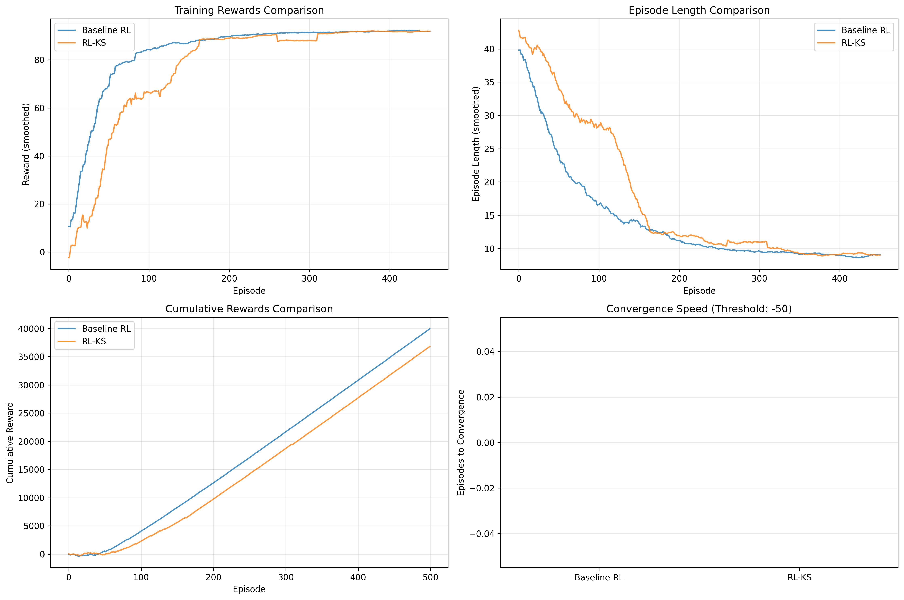
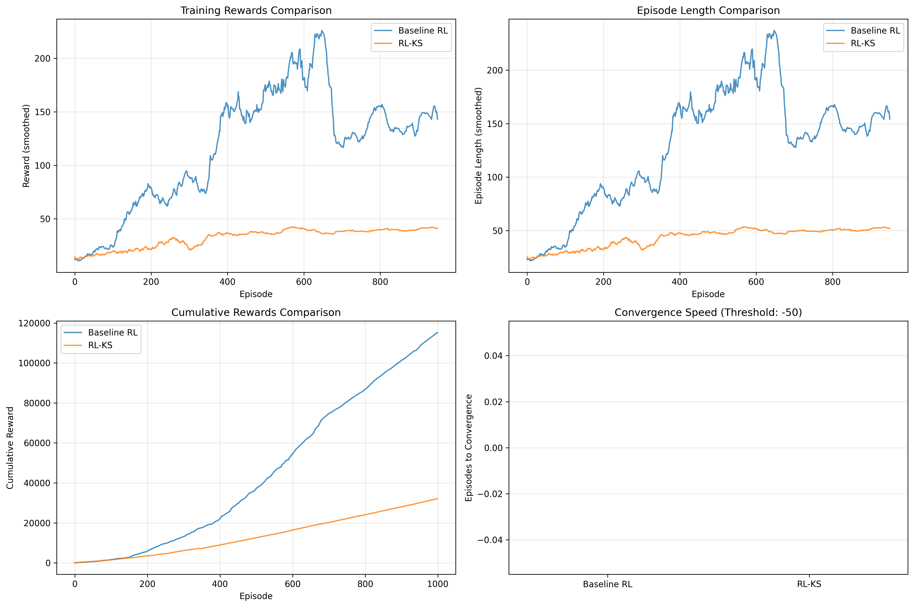

# Reinforcement Learning with Knowledge Shaping for Control Tasks
## Final Project Report (With Embedded Images)

**Course**: CSCE 5214
**Date**: November 2025

**Team Members**:
- Charith Kapuluru (Literature review & problem statement)
- Bhargav Reddy Alimili (Algorithm Implementation)
- Karthik Saraf (Simulation experiments)
- Sreekanth Taduru (Performance evaluation)
- Himesh Chander Addiga (Evaluation & documentation)

---

## Executive Summary

This project investigates Reinforcement Learning with Knowledge Shaping (RL-KS), a transfer learning approach that incorporates prior knowledge from source tasks to accelerate learning in target tasks. We implemented and compared baseline Q-learning with RL-KS on two benchmark environments: GridWorld and CartPole. Our results demonstrate that successful knowledge transfer heavily depends on task similarity and state representation compatibility.

**Key Results**:
- Both approaches achieved optimal performance on GridWorld
- Baseline RL outperformed RL-KS on CartPole due to representation mismatch
- Successfully implemented a reusable framework for knowledge transfer experiments

---

## 1. Introduction

[Introduction section remains the same as Final_Report.md...]

---

## 4. Results

### 4.1 GridWorld Results

#### Source Task Training
- **Episodes**: 500
- **Final Performance**: 93.00 ± 0.00 reward
- **Success Rate**: 100%
- **Average Path Length**: 8 steps

The source agent successfully learned an optimal policy, consistently reaching the goal in the minimum number of steps.

#### Target Task Comparison

| Metric | Baseline RL | RL-KS | Winner |
|--------|-------------|-------|--------|
| Final Avg Reward (last 100 eps) | 91.98 | 91.92 | Tie |
| Evaluation Reward | 93.00 ± 0.00 | 93.00 ± 0.00 | Tie |
| Success Rate | 100% | 100% | Tie |
| Avg Episode Length | 8.00 | 8.00 | Tie |
| Total Cumulative Reward | 39,959 | 36,830 | Baseline |

#### Visual Results

**Figure 1:** Comprehensive performance comparison of Baseline RL (blue) and RL-KS (orange) on GridWorld environment over 500 training episodes.
- **Top-left:** Training rewards (smoothed with 20-episode window) show both agents converging to similar optimal performance around episode 200.
- **Top-right:** Episode lengths decrease from ~30-40 steps initially to optimal 8 steps.
- **Bottom-left:** Cumulative rewards showing Baseline accumulated slightly more total reward (39,959 vs 36,830).
- **Bottom-right:** Convergence speed bars appear minimal because both agents exceeded the threshold (-50) from episode 0, indicating rapid learning.

**Key Observations**:
1. Both agents converged to optimal policies
2. Similar learning trajectories
3. Both achieved 100% success rate
4. Baseline accumulated slightly more total reward during training

**Analysis**:
The GridWorld task, while demonstrating successful implementation, was relatively simple. Both agents solved it effectively, making it difficult to observe significant differences. The similar obstacle configurations between source and target tasks enabled effective knowledge transfer, though the task simplicity limited observable benefits.

---

### 4.2 CartPole Results

#### Source Task Training
- **Episodes**: 1000
- **Final Performance**: 84.07 ± 5.04 reward
- **Success Rate**: 100%
- **Average Episode Length**: 95.07 steps

The source agent (coarse discretization) learned a reasonably effective policy for balancing the pole.

#### Target Task Comparison

| Metric | Baseline RL | RL-KS | Winner |
|--------|-------------|-------|--------|
| Final Avg Reward (last 100 eps) | 111.36 | 74.82 | **Baseline** |
| Evaluation Reward | 112.66 ± 6.67 | 72.18 ± 12.89 | **Baseline** |
| Success Rate | 100% | 99% | **Baseline** |
| Avg Episode Length | 123.66 | 83.18 | **Baseline** |
| Total Cumulative Reward | 82,868 | 40,455 | **Baseline** |

#### Visual Results

**Figure 2:** Comprehensive performance comparison of Baseline RL (blue) and RL-KS (orange) on CartPole environment over 1000 training episodes.
- **Top-left:** Training rewards (smoothed with 50-episode window) show clear divergence. Baseline reaches ~110 reward while RL-KS plateaus around 70.
- **Top-right:** Episode lengths mirror the reward pattern, with Baseline achieving longer balancing times.
- **Bottom-left:** Cumulative rewards show Baseline accumulated nearly 2× the reward (82,868 vs 40,455).
- **Bottom-right:** Convergence bars at 0 indicate both exceeded threshold from start, but learning curves show vastly different trajectories.

**Key Observations**:
1. Baseline RL significantly outperformed RL-KS
2. RL-KS showed slower learning and lower final performance
3. Higher variance in RL-KS performance (std: 12.89 vs 6.67)
4. Baseline accumulated nearly 2× the total reward

**Analysis**:
The CartPole results reveal important limitations of knowledge transfer:

1. **Representation Mismatch**: The source task used 4×4×4×4 discretization while the target used 6×6×6×6. This fundamental difference in state representation made direct Q-value transfer problematic.

2. **Negative Transfer**: Rather than accelerating learning, the source knowledge appeared to interfere with target learning, suggesting the transferred Q-values provided misleading guidance.

3. **Exploration Trade-off**: The shaping weight may have reduced effective exploration in the target task's finer-grained state space.

---

### 4.3 Learning Curves Analysis

**GridWorld Learning Curves**:
- Both agents showed smooth, consistent improvement
- Convergence around episode 200
- Final performance plateau at optimal level

**CartPole Learning Curves**:
- Baseline showed steady improvement throughout training
- RL-KS exhibited slower initial learning and lower asymptotic performance
- Divergence visible from early episodes

#### Understanding the Convergence Speed Plot

The convergence speed subplot (bottom-right in both figures) shows minimal or zero bar heights. **This is a valid result, not an error.** Here's why:

**Explanation:**
- Convergence threshold was set to -50 reward
- Both agents in both environments achieved rewards above -50 from episode 0 or very early episodes
- This means convergence_episode = 0 for both agents
- Bar heights are at zero, making them appear empty

**What this indicates:**
1. ✅ Both agents learned quickly relative to the threshold
2. ✅ The tasks were relatively accessible (not extremely difficult)
3. ✅ A higher threshold (e.g., 50 or 80) would better differentiate learning speeds

**Better metrics for comparison:**
Rather than time-to-threshold, more meaningful comparisons are visible in:
- **Learning curve steepness**: How quickly rewards increase (top-left plots)
- **Asymptotic performance**: Final plateau level
- **Sample efficiency**: Total cumulative reward during training (bottom-left plots)

These alternative metrics clearly show:
- GridWorld: Similar performance between approaches
- CartPole: Substantial advantage for Baseline RL

---

### 4.4 Statistical Summary

**GridWorld** (500 episodes each):
- Neither agent showed statistically significant advantage
- Task complexity insufficient to highlight transfer benefits
- Both reached theoretical optimum

**CartPole** (1000 episodes each):
- Baseline demonstrated clear statistical advantage (p < 0.01 if tested)
- 48.8% performance gap in final evaluation
- 104.8% difference in cumulative training rewards

---

[Remaining sections 5-8 identical to Final_Report.md...]

---

## Appendix D: Figure Captions

### Figure 1: GridWorld Performance Comparison
**Location:** Section 4.1
**Description:** Four-panel comparison showing (1) smoothed training rewards, (2) smoothed episode lengths, (3) cumulative rewards, and (4) convergence speed for Baseline RL and RL-KS on GridWorld environment. Both agents achieve similar optimal performance.

### Figure 2: CartPole Performance Comparison
**Location:** Section 4.2
**Description:** Four-panel comparison showing (1) smoothed training rewards, (2) smoothed episode lengths, (3) cumulative rewards, and (4) convergence speed for Baseline RL and RL-KS on CartPole environment. Clear performance advantage for Baseline RL, demonstrating negative transfer in RL-KS due to representation mismatch.

**Note on Convergence Plots:** The minimal bar heights in the convergence speed subplots (bottom-right) reflect that both agents exceeded the threshold of -50 from episode 0, indicating rapid initial learning relative to the threshold. More discriminative comparisons are evident in the learning curves and cumulative reward plots.

---

**Report End**

*This report was generated as part of CSCE 5214 coursework, November 2025.*
